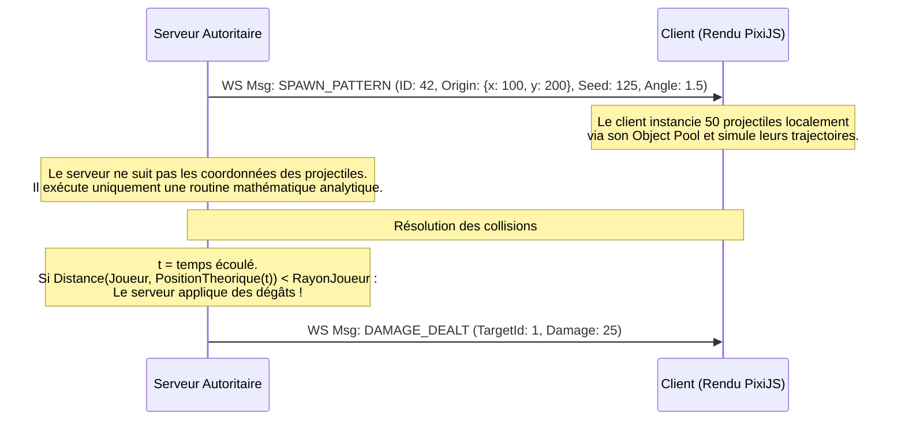

# Fiche Technique 03 : Netcode WebSockets & Optimisation Réseau (Bullet Hell)

Ce document décrit le protocole réseau en temps réel, l'optimisation de la bande passante pour le Bullet Hell et le système de réconciliation client/serveur.

---

## 1. Protocole de Communication : WebSockets & Format Binaire

Pour éviter les congestions réseau avec 4 joueurs et des centaines de sbires, le protocole de transport utilise des **WebSockets standard** (via `uWebSockets.js` côté serveur) couplés à une sérialisation en **format binaire** pour les données de jeu en temps réel.

### Format des Messages (ArrayBuffer / DataView)
Plutôt que d'envoyer du JSON lourd (`{"x": 12.3, "y": 45.6}`), les paquets réseau critiques de mouvement et d'état (snapshots) sont compactés dans des structures binaires compactes.

*   **Structure d'un Snapshot d'Entité (16 octets)** :
    *   `EntityID` : 4 octets (Uint32)
    *   `PosX` : 4 octets (Float32)
    *   `PosY` : 4 octets (Float32)
    *   `Angle` : 2 octets (Int16, angle mis à l'échelle de -32768 à 32767)
    *   `HealthPercent` : 1 octet (Uint8, de 0 à 100)
    *   `Flags` : 1 octet (Uint8, K.O., invulnérable, etc.)

---

## 2. Système de Synchronisation du Mouvement

Pour masquer la latence réseau (Ping), le jeu implémente le triptyque classique des jeux multijoueurs temps réel :

### A. Prédiction Côté Client (Client-Side Prediction)
*   Le client local n'attend pas la réponse du serveur pour se déplacer. Dès qu'une touche (ZQSD) est pressée, le client déplace son personnage localement.
*   Chaque input envoyé au serveur est marqué d'un numéro de séquence incrémental (`sequenceNumber`).

### B. Réconciliation Serveur (Server Reconciliation)
*   Le serveur reçoit les inputs, calcule le déplacement valide, et renvoie périodiquement la position finale validée accompagnée du dernier `sequenceNumber` traité.
*   Si la position du serveur diffère de celle calculée localement par le client (à cause d'une collision ou d'une divergence de calcul) :
    1.  Le client repositionne son entité à la coordonnée du serveur.
    2.  Le client ré-applique localement tous ses inputs stockés en mémoire tampon dont le numéro de séquence est supérieur à celui acquitté par le serveur.

### C. Interpolation des Entités (Entity Interpolation)
*   Les autres joueurs et les ennemis ne sont pas prédits. Le client les affiche avec un léger retard (ex: 100 ms) en effectuant une interpolation linéaire (LERP) entre les deux derniers états réseaux reçus pour assurer un mouvement fluide sans téléportation.

---

## 3. Optimisation Réseau du Bullet Hell : Projectiles Décentralisés

Le point le plus critique : synchroniser des centaines de projectiles par WebSocket saturerait immédiatement la connexion internet.

### Principe de la Simulation Visuelle Locale
Les projectiles individuels ne sont **jamais** envoyés sur le réseau.

### Détail de l'implémentation :
1.  **Émission du Pattern** : Lorsque le Boss déclenche une attaque en cercle (ex: 36 projectiles), le serveur diffuse un seul message binaire court :
    *   `Type` (1 octet) : `SPAWN_PATTERN`
    *   `PatternID` (2 octets) : ID du pattern scripté
    *   `OriginX/Y` (8 octets) : Point de départ
    *   `BaseAngle` (4 octets) : Direction
    *   `Seed` (4 octets) : Graine aléatoire pour les variations de dispersion
2.  **Rendu Client** : À la réception, le client utilise son `ObjectPool` de projectiles pour créer et animer visuellement 36 projectiles à l'écran.
3.  **Collision Autoritaire Côté Serveur** :
    *   Le serveur ne crée pas d'objets physiques individuels de projectiles dans sa mémoire pour éviter de surcharger le processeur.
    *   Le serveur conserve uniquement la définition active du pattern (ex: Rayons en expansion continue de $t=0$ à $t=3s$ depuis le centre $X,Y$).
    *   À chaque tick, le serveur calcule analytiquement l'équation du pattern : *"Où doivent se situer les projectiles à la fraction de seconde $t$ ?"*
    *   Le serveur applique cette équation uniquement contre la hitbox circulaire du joueur local pour déterminer les impacts. Si impact, le serveur applique les dégâts et émet l'événement `DAMAGE_DEALT` (qui déclenche les animations d'impact et de perte de vie sur le client).
